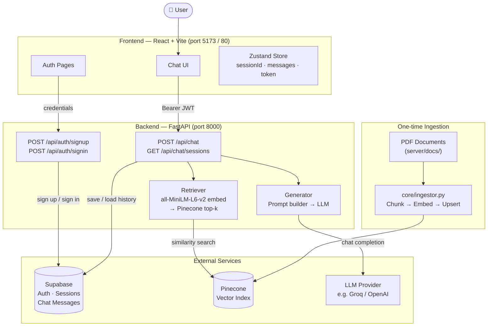

# FloorMan

**FloorMan** is an AI-powered Q&A assistant for manufacturing workers. Ask questions in plain English and receive accurate, cited answers drawn from authoritative documents covering standard operating procedures, workplace safety, equipment maintenance, quality control, and regulatory compliance.

Backed by a RAG (Retrieval-Augmented Generation) pipeline: questions are embedded, the most relevant document chunks are retrieved from a vector database, and an LLM synthesises a grounded answer with source citations — all within a persistent, multi-session chat interface.

---

## Features

- **Document-grounded answers** — responses always cite the source document and page number
- **Conversation memory** — full chat history is stored per session and passed to the LLM
- **Multi-session sidebar** — browse and resume previous conversations
- **Auth** — email/password sign-up and sign-in via Supabase with Row Level Security
- **Provider-agnostic LLM** — swap the language model without changing application code
- **Containerised** — runs with a single `docker compose up`

---

## Knowledge Base

Five PDF documents ship with the project:

| Document | Topic |
|---|---|
| EPA SOP Guide | Writing, structuring, and maintaining Standard Operating Procedures |
| OSHA Safety and Health Program Management Guide | Hazard identification, incident reporting, PPE, emergency procedures |
| DOE Operations and Maintenance Best Practices Guide | Preventive maintenance, equipment upkeep, reducing downtime |
| NIST Quality Manual | Quality control, measurement standards, calibration, quality assurance |
| OSHA Quick Reference for Manufacturing | Safety regulations, warning signs, confined spaces, compliance |

---

## Tech Stack

| Layer | Technology |
|---|---|
| Frontend | React 19 + TypeScript, Vite, Tailwind CSS v4, Zustand |
| Backend | FastAPI, Python 3.12, uv |
| Embeddings | `sentence-transformers/all-MiniLM-L6-v2` (local, 384-dim) |
| Vector DB | Pinecone |
| LLM | Any OpenAI-compatible provider (Groq, OpenAI, Together AI, Ollama…) |
| Auth + Storage | Supabase (PostgreSQL + Row Level Security) |

---

## Architecture



### Request flow (single question)

```
Browser → POST /api/chat
            │
            ├─ Load session history from Supabase
            ├─ Embed question → Pinecone similarity search → top-k chunks
            ├─ Build prompt (system + history + chunks + question)
            ├─ Call LLM → stream answer
            ├─ Save user message + assistant reply to Supabase
            └─ Return { answer, sources } to browser
```

---

## Quick Start

See [setup.md](setup.md) for the full setup guide including external service configuration, environment variables, and Docker instructions.

```bash
# 1. Configure environment
cp server/.env.example server/.env   # fill in API keys
cp client/.env.example client/.env

# 2. Ingest documents
cd server && uv sync
uv run python -m core.ingestor

# 3. Start backend
uv run python -m uvicorn api.main:app --reload

# 4. Start frontend (new terminal)
cd client && npm install && npm run dev
```

Or with Docker:

```bash
docker compose up --build
```

---

## Project Structure

```
manufacturing-rag/
├── server/                     # FastAPI backend
│   ├── api/
│   │   ├── auth/               # Sign-up / sign-in
│   │   ├── chat/               # Sessions + messages + RAG
│   │   ├── dependencies.py     # JWT auth dependency
│   │   ├── supabase_client.py  # Supabase client helpers
│   │   └── main.py             # App entry point + CORS
│   ├── core/
│   │   ├── ingestor.py         # PDF → chunks → Pinecone (run once)
│   │   ├── retriever.py        # Embed question → Pinecone search
│   │   └── generator.py        # Prompt assembly → LLM call
│   ├── docs/                   # Place PDF documents here
│   ├── Dockerfile
│   └── pyproject.toml
├── client/                     # React + Vite frontend
│   ├── src/
│   │   ├── api/                # Axios wrappers
│   │   ├── components/         # Chat UI, Sidebar, Auth forms
│   │   ├── pages/              # AuthPage, ChatPage
│   │   └── store/              # Zustand auth + chat stores
│   ├── Dockerfile
│   ├── nginx.conf              # Production reverse proxy config
│   └── vite.config.ts
├── docker-compose.yml
└── setup.md                    # Full setup instructions
```

---

## License

MIT
